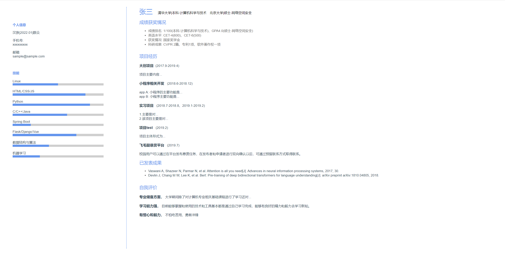
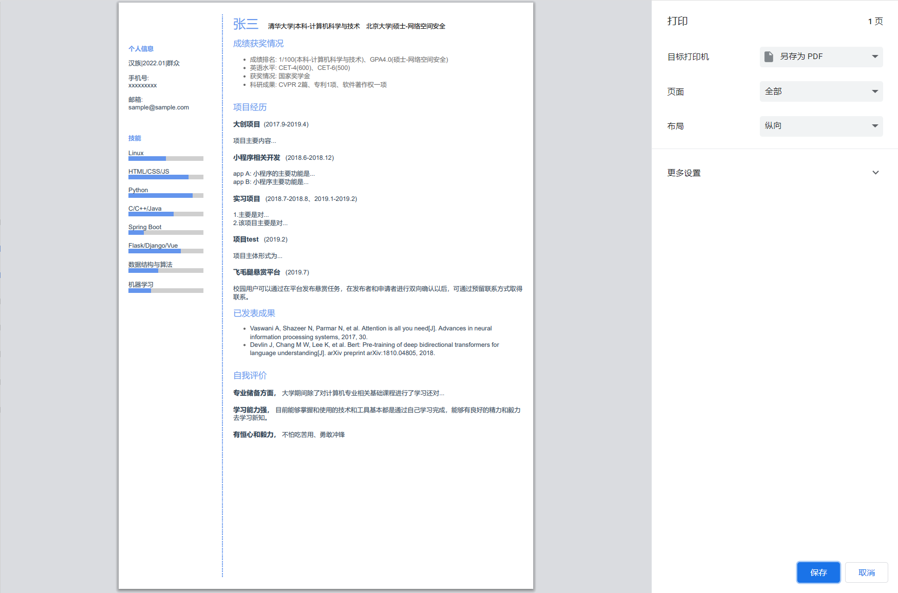

# 个人简历模板

> A Vue.js project

## Build Setup

``` bash
# install dependencies
npm install

# serve with hot reload at localhost:8080
npm run dev

# build for production with minification
npm run build

# build for production and view the bundle analyzer report
npm run build --report
```
####使用说明
```
分割线两侧分别在src/components/Header.vue和src/components/Details.vue中，可根据两个vue文件中的data() {return {}}中内容提示进行相应的修改
```
####效果展示
1. 网页全屏效果
   

2. 网页转pdf
   

